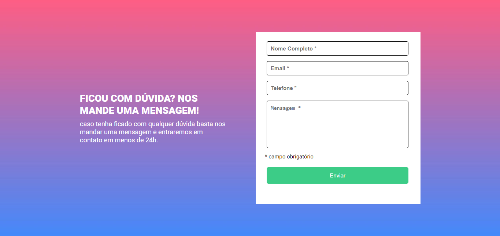

# Formulario com validação JavaScript Puro

Desafio feito para o  curso de front-end DevQuest, modulo de JavaScript Intermediario.

## Indice
- [Proposta do desafio](#proposta-do-desafio)
- [Tecnologias Utilizadas](#tecnologias-utilizadas)
- [Projeto](#projeto)
    - [ScreenShots](#screenshoot)
    - [Meu processo](#meu-processo)
- [Autor](#autora)

## 🚀 Proposta do desafio

- A validação do formulário deve ser feita com
javascript puro.
- Ao clicar para enviar o formulário, se caso
algum campo não estiver preenchido, a borda
do input deve ficar vermelha e uma mensagem
de "campo obrigatório" deve aparecer embaixo
do campo que não foi preenchido, conforme o
figma.
- quando um campo for preenchido, na mesma
hora a borda do input deve ficar verde e o
texto "campo obrigatório" deve sumir.
o fundo do formulário deve ser feito usando a
imagem em anexo na hotmart e usando o
background-repeat: repeat.

## Tecnologias Utilizadas

 

## Projeto

### ScreenShoot

 

 

### 📋 Meu processo 
 
Durante a realização desse formulario, utilizei HTML, CSS e JavaScript. O foco era, principalmente, na validação do formulario em javascript puro.
 
Fiz algumas tentativas para essa validação, em uma utilizei ForEach, em outra a validação de sucesso aparecia apenas o botão fosse clicado novamente e não era esse o resultado que eu buscava - e que o desafio pedia. 
Depois de pesquisar e fazer mais tentativas, consegui o resultado esperado com <strong>event blur.</strong>

 

## Autor(a)

 

>Maria Eduarda Nascimento

   